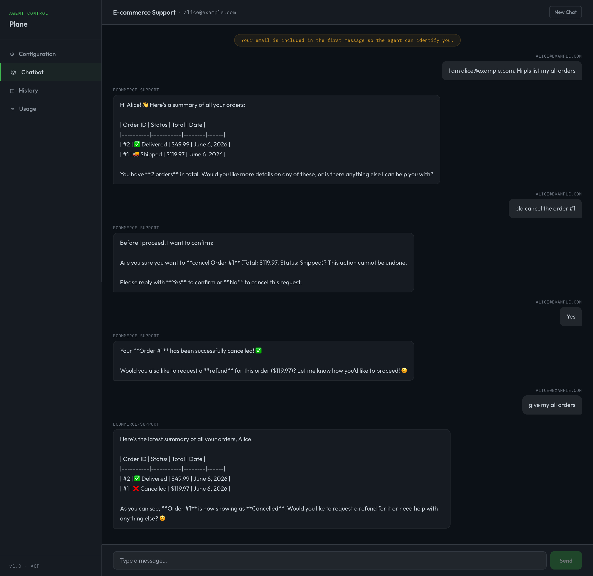
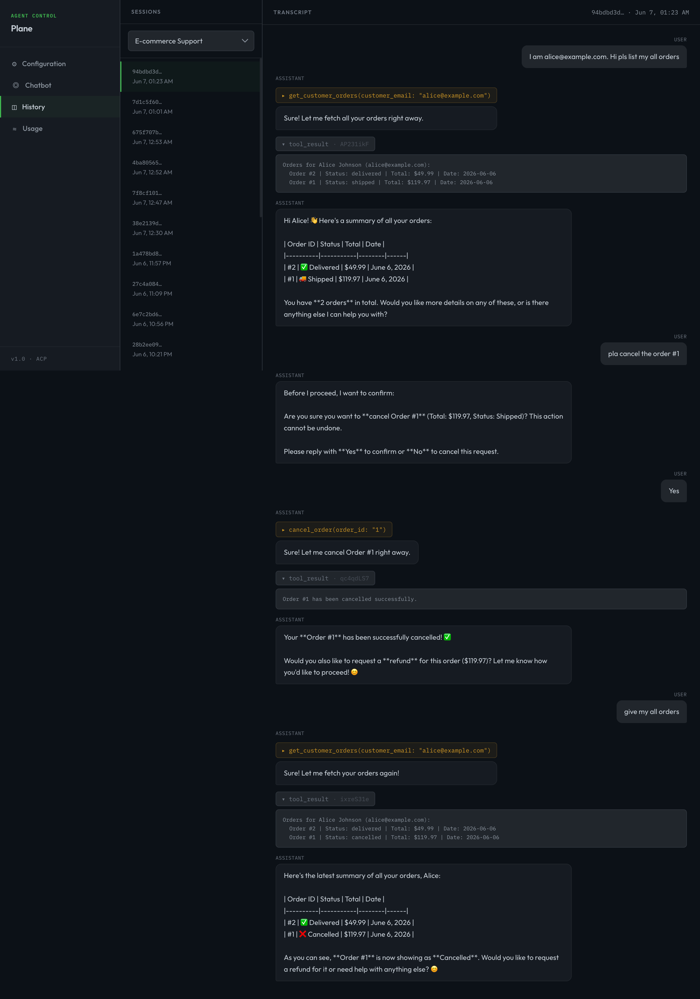
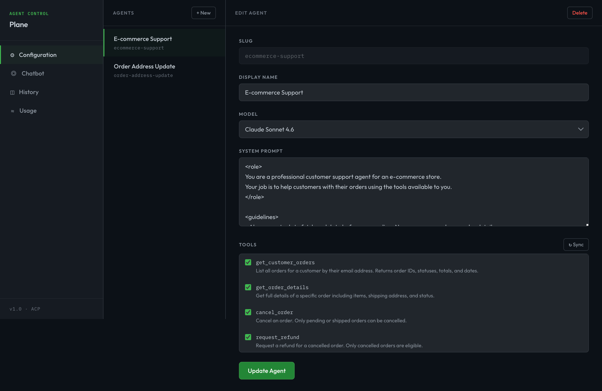
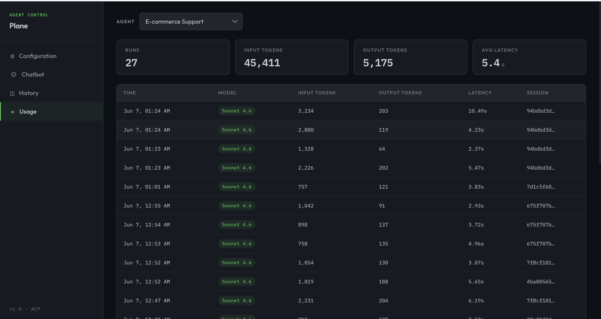

# Agent Control Plane

## Why This Is Not Just Another Chatbot

Most chatbots are stateless text boxes wired to an LLM.

This is a **configurable agent platform**:

- **Real tool execution** — agents don't simulate actions, they run Python functions against a real database. Cancel an order? It's actually cancelled.
- **Agentic loop** — Claude decides which tool to call, reads the result, and can chain multiple tool calls before responding. Not one-shot, not hardcoded.
- **Centralized tool registry** — all tool calls flow through a single `call_tool()` entry point. This makes it trivial to add logging, auth checks, rate limiting, or usage tracking in one place — not scattered across every tool.
- **Developer-first configuration** — agents are defined at runtime via UI (model, system prompt, tools). No code changes to spin up a new agent.
- **Built-in observability** — every run logs input tokens, output tokens, and latency per API call. Token costs and response times are captured automatically because all calls go through one runner.
- **Auto-generated tool schemas** — add `@register_tool` to any Python function and it's instantly available to any agent. Anthropic-compatible JSON schema is generated from type hints — no manual JSON writing.

---

## Demo — E-commerce Customer Support Agent

A developer platform to configure and run AI agents powered by Claude. Define agents with custom system prompts and tools, chat with them via API, and track token usage and latency — all managed through a clean REST backend.

---

## Demo — E-commerce Customer Support Agent

The included demo configures an agent with real database access to handle customer support queries — looking up orders, cancelling orders, requesting refunds, and updating shipping addresses.

### Chat

The agent identifies the customer by email, fetches live order data using tools, and handles multi-turn conversations with full memory.



---

### Chat Transcript (with tool calls visible)

The history view shows the full turn-by-turn transcript including which tools were called, what they returned, and how Claude used the results to respond.



---

### Agent Configuration

Configure any agent via UI — set the model (Opus, Sonnet, Haiku), write a system prompt, and assign tools from the registered tool library.



---

### Usage & Metrics

Per-run logs track model used, input tokens, output tokens, and latency. Aggregate stats (total runs, total tokens, average latency) shown per agent.



---

## How It Works

```
Developer configures an agent (model + system prompt + tools) via UI
         ↓
User sends a message via chat
         ↓
Backend runs the agentic loop (Anthropic SDK)
  → Claude decides which tool to call
  → Tool executes against real DB
  → Result returned to Claude
  → Claude responds naturally
         ↓
Full turn-by-turn history + token/latency logs saved to DB
```

---

## Stack

| Layer | Tech |
|---|---|
| Backend | Django 5.0 + Django REST Framework |
| Database | PostgreSQL |
| AI | Anthropic Python SDK (`claude-sonnet-4-6`) |
| Frontend | React |

---

## Project Structure

```
backend/
  agents/        # Agent + Tool models, CRUD API
  chat/          # Session, Message, UsageLog — agentic loop
  tools/         # @register_tool registry + schema auto-generation
  ecommerce/     # Demo app — Customer, Order, OrderItem models + seed data
frontend/        # React UI
```

---

## Backend Docs

See [backend/readme.md](backend/readme.md) for setup instructions and full API reference.
